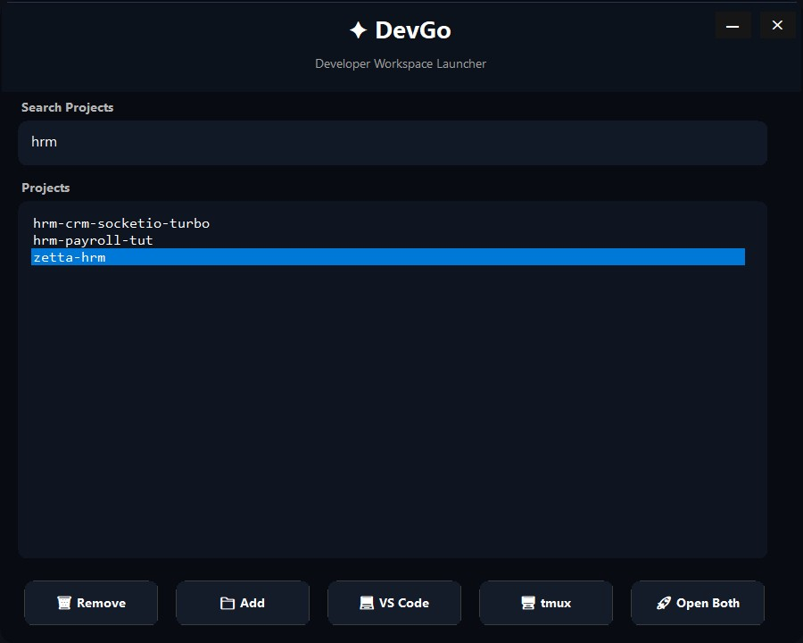

<p align="center">
  
</p>

# 🚀 DevGo

> A lightweight WSL-first developer launcher for VS Code + tmux workflows.


---

# ✨ Features

⚡ Instant project launcher
💻 Launch VS Code directly
🖥️ Launch tmux sessions
🚀 Open full development environments
📁 Persistent workspace management
🔎 Live project search
🎨 Modern dark UI
⌨️ Keyboard-friendly workflow
🧠 WSL-first architecture
🔥 Lightweight native WinForms app
🖥️ Recommended tmux workflow support

---

## 🖼️ Screenshot



---

# 📦 Requirements

Install the following:

- .NET 10 SDK
- VS Code
- WSL
- tmux

---

# 🔧 Install .NET 10 SDK

Download:

https://dotnet.microsoft.com/download/dotnet/10.0

Verify installation:

```bash
dotnet --version
```

---

# 🖥️ Install WSL

Run PowerShell as Administrator:

wsl --install

Restart Windows after installation.

---

# 📦 Install tmux inside WSL

Ubuntu/Debian:

sudo apt update

sudo apt install tmux -y

Verify:

tmux -V

---

# 🖥️ Recommended tmux Configuration

Create:

~/.tmux.conf

Example configuration:

set -g mouse on

set -g history-limit 100000

set -g base-index 1

setw -g pane-base-index 1

set -g renumber-windows on

set -g detach-on-destroy off

set -g status-position top

set -g default-terminal "screen-256color"

set -g extended-keys on

Reload configuration:

tmux source-file ~/.tmux.conf

Restart tmux completely:

tmux kill-server

---

## 🔥 Useful tmux Shortcuts

| Shortcut | Action            |
| -------- | ----------------- |
| Ctrl+b c | Create new window |
| Ctrl+b n | Next window       |
| Ctrl+b p | Previous window   |
| Ctrl+b % | Vertical split    |
| Ctrl+b " | Horizontal split  |
| Ctrl+b d | Detach session    |

---

## 🚀 DevGo tmux Workflow

DevGo automatically creates:

1: code
2: agents
3: git

inside a tmux session for the selected project.

---

# 💻 Enable VS Code Command Line Integration

Open VS Code.

Press:

Ctrl + Shift + P

Search:

Shell Command: Install 'code' command in PATH

Verify:

code --version

---

# ▶️ Run Application

Inside project folder:

dotnet publish DevGo.csproj -c Release -r win-x64

---

# 🔥 Development Mode

Automatically rebuilds and restarts on file changes:

dotnet watch run

---

# 🏗️ Build Application

dotnet build

---

# ✅ Validate App Icon (Before Release)

Run:

```powershell
powershell -ExecutionPolicy Bypass -File .\scripts\validate-icon.ps1
```

The check fails if `assets/icon.ico` is missing required sizes:
`16, 24, 32, 48, 64, 128, 256`.

---

# 📦 Publish Release EXE

dotnet publish -c Release

Published files:

bin/Release/net10.0-windows/win-x64/publish/

---

# 📦 Create Windows Installer

DevGo uses Inno Setup to create a lightweight native Windows installer.

## Install Inno Setup

Download:

https://jrsoftware.org/isdl.php

---

## Publish Application

dotnet publish -c Release

---

## Create Installer

Open:

installer/DevGo.iss

inside Inno Setup and press:

to compile the installer.

---

## Installer Output

The generated installer will be located inside:

installer/output/

Example:

DevGo-Setup.exe

# ⌨️ Controls

| Action       | Behavior                |
| ------------ | ----------------------- |
| Double Click | Launch selected project |

---

# ⌨️ Keyboard Shortcuts

Coming soon:

- Enter → Open project
- Ctrl + K → Focus search
- Arrow navigation
- Full keyboard-only workflow

---

# 🧠 Built For

Optimized for:

- TurboRepo
- Next.js
- NestJS
- WSL
- tmux
- AI coding agents
- terminal-first development

---

# 🛠️ Tech Stack

- C#
- WinForms
- .NET 10
- WSL
- tmux
- VS Code CLI

---

# 🚀 DevGo is intentionally developed using a lightweight workflow centered around:

- 🧩 VS Code
- 🖥️ terminal-first development
- ⚡ native WinForms
- 📦 Inno Setup packaging

The goal is to keep the project fast, simple, and free from unnecessary tooling overhead.

---

# 🚀 Future Plans

- Recent projects
- Pinned projects
- AI launcher integration
- Docker integration
- Git shortcuts
- Tray mode
- Project icons
- Workspace profiles
- Terminal tabs
- Command palette
- Keyboard-only navigation

---

# ⚠️ Known Issues

DevGo was launched today, so a few rough edges still exist while the project stabilizes.

- Icon rendering can be inconsistent on some Windows setups until icon cache refresh
- Installer/startup behavior may vary across machines and environments
- Some keyboard shortcuts are still in progress

These are being improved release by release.

---

# 🤝 Contributing

Contributions are very welcome.

If you want to help:

- Open an issue for bugs, ideas, or UX improvements
- Submit a pull request for fixes or features
- Keep changes focused and include clear reproduction steps for bug fixes

Small improvements are just as valuable as large features.

---

# ❤️ Philosophy

DevGo is intentionally:

- lightweight
- native
- fast
- terminal-focused
- WSL-first
- workflow-oriented

No Electron.
No unnecessary bloat.

---

💭 Why DevGo Exists

DevGo started as a small personal tool built to simplify a heavy daily development workflow involving WSL, tmux, VS Code, monorepos, and AI-assisted coding.

What began as a fun side experiment quickly became an essential part of the workflow.

The goal of DevGo is simple:

reduce friction
launch projects instantly
keep developers inside their terminal-first workflow
stay lightweight and fast

Built by a real developer for real daily use.

---

# 📄 License

MIT License
